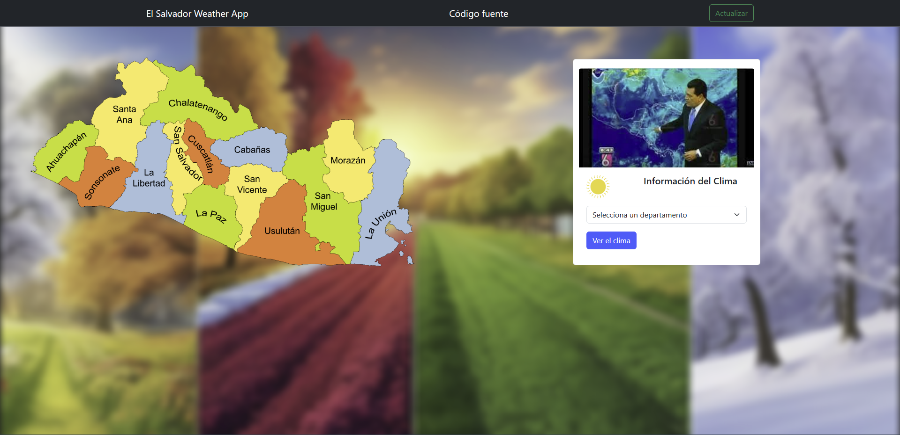
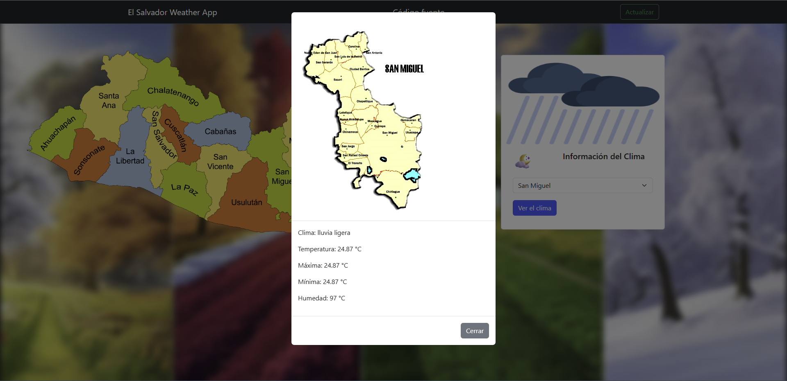

# El Salvador Weather App



**El Salvador Weather App** es una aplicación educativa que utiliza la API de OpenWeatherMap para mostrar información climática de diferentes departamentos de El Salvador.

## Desarrolladores

- Hugo Alexander Ulloa Serpas - US21003
- Ángel Gabriel Vásquez Crespo - VC21007

## Acerca del Proyecto

El Salvador Weather App es un proyecto con fines educativos que demuestra cómo utilizar la API de openweathermap.org para obtener y mostrar datos climáticos en una aplicación web. La aplicación muestra la información climática actualizada de diversos departamentos de El Salvador, incluyendo detalles como la temperatura, humedad y más.

## Capturas de Pantalla


_Vista del departamento deseado con la información del clima_


## Cómo Usar

1. Clona el repositorio:

```sh
git clone https://github.com/alexus21/ElSalvadorWeatherApp.git
```

2. Abre el archivo index.html en tu navegador web.

3. Selecciona un departamento de El Salvador en el menú desplegable y haz clic en "Ver Clima" para obtener la información climática.

## Tecnologías Utilizadas
- HTML
- CSS
- JavaScript

<hr>

<i>Proyecto realizado con fines educativos</i>

